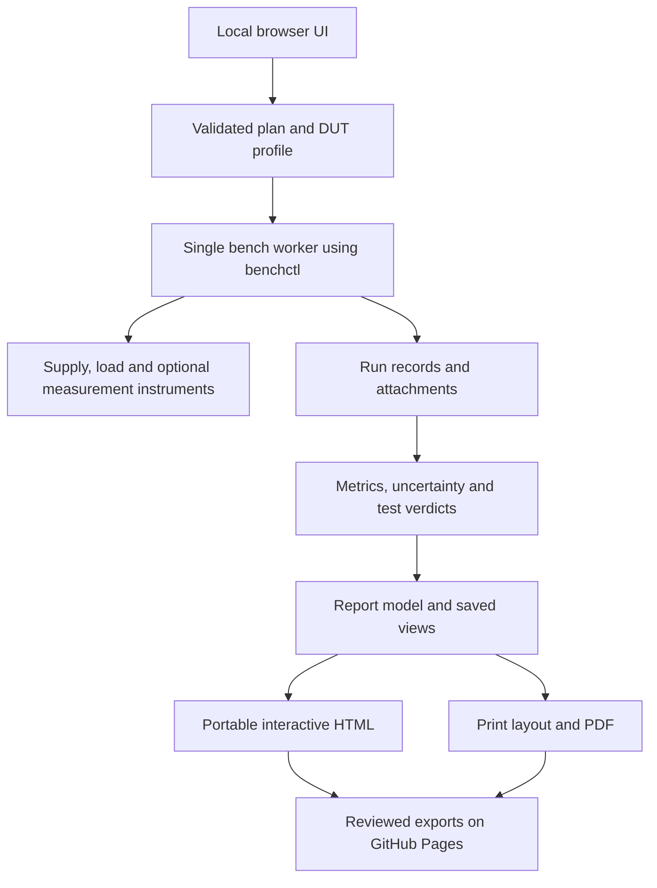

# DC–DC characterization and reporting plan

Research and architecture proposal · 26 September 2026

Updated after reviewing `mbA2D/Test_Equipment_Control` and the supplied alternative
architecture: NiceGUI and Quarto are now the preferred first prototype. The
instrument runner and saved-data boundary remain the foundation.

This proposal builds on the existing `benchctl` library. It defines future
features; no converter measurements or new instrument-control functions were
implemented as part of this research. Specific DUT limits and the remaining
instrument inventory still need to be supplied.

## Recommended direction

Build a local browser application for configuring and running tests, backed by
the existing Python execution engine. Generate an independent, portable HTML
report and a matching PDF from saved results. Preserve measurement records when
editing the report, adding images, or changing a graph.

Use Python for acquisition and analysis; YAML/JSON for validated plans and
metadata; HTML/CSS/JavaScript for the interface and interactive report; PDF for
the issued document. Word can be an optional export later. XML is unnecessary
for the initial design.

## 1. What the existing bench can measure

| Instrument | Rated envelope |
| --- | --- |
| DP821A CH1 | 0–60 V, 0–1 A: at most 60 W. |
| DP821A CH2 | 0–8 V, 0–10 A: at most 80 W. |
| DL3031A | 150 V, 60 A, 350 W, subject to simultaneous limits and low-voltage compliance. |

References: [Rigol DP800 datasheet, pp. 4–5](https://www.rigol.com/dam/global/downloads/brochures/en/data-sheet/dc-powers/DP800_DataSheet_EN.pdf)
and [DL3000 datasheet, pp. 3–4](https://www.rigol.com/dam/global/downloads/brochures/en/data-sheet/dc-load/DL3000_DataSheet_EN.pdf).

The source channel's available power changes with input voltage. A 60 V endpoint
also leaves no guaranteed headroom above 60 V for input-tolerance testing.
Plan each point against the source, load, DUT, wiring, and fixture limits.

### Accuracy is a separate issue

DP821A CH1 current readback is specified as ±(0.15% of reading + 10 mA), despite
0.1 mA display resolution. An illustrative 48 V to 5 V/1 A converter at assumed
90% efficiency draws about 116 mA; that specification allows about ±10.2 mA.
It cannot support fine efficiency comparisons at that operating point.
[DP800 readback specifications](https://www.rigol.com/dam/global/downloads/brochures/en/data-sheet/dc-powers/DP800_DataSheet_EN.pdf).

The load's range also matters: current readback on its 6 A range is
±(0.05% + 3 mA), versus ±(0.05% + 30 mA) on its 60 A range. Record actual ranges
and applicable calibration/specification conditions.
[Rigol verification manual, Table 2-4](https://www.rigol.com/dam/global/downloads/brochures/en/performance-verification/dc-load/DL3000_PerformanceVerificationManual_EN.pdf).

Define the measurement boundary before calculating efficiency: board connectors,
power-stage terminals, or a complete module including its filters and auxiliaries.
Measure voltage at that boundary. Include auxiliary input power when it belongs
inside the stated boundary. Cable drops, meter burden, and filter losses must
have an explicit treatment.
[ADI efficiency measurement guide](https://www.analog.com/en/resources/technical-articles/how-to-measure-the-efficiency-of-a-multiphase-buck-converter-integrated-circuit.html).

For settled DC measurements:

\[
\eta = 100\frac{V_{out} I_{out}}{V_{in} I_{in}},\qquad
P_{loss}=P_{in}-P_{out}.
\]

Use measured values. With material ripple or changing loads, average voltage
times average current need not equal average instantaneous power. Sequential
SCPI readings are suitable only when their timing and steady-state assumptions
are justified; waveform power needs suitable synchronized acquisition.
[TI SLVA236A: power-save-mode efficiency measurement](https://www.ti.com/lit/an/slva236a/slva236a.pdf?ts=1736675229204).

## 2. Test catalogue

These are engineering characterization choices, not a universal certification
checklist. Each selected test needs conditions, measurement definitions and,
where appropriate, acceptance limits.

| Test | Question answered | Equipment and report |
| --- | --- | --- |
| Bring-up and output accuracy | Does the assembled board regulate at a modest, valid operating point? | Supply/load; measured output and error relative to target. |
| Efficiency and loss map | Where is conversion efficient, and where is power dissipated? | Input-voltage × load grid; precision terminal measurements for defensible efficiency. Curves and a coverage map. |
| Load regulation | How does output change with current at fixed input? | Output voltage/error versus measured output current. |
| Line regulation | How does output change with input at fixed load? | Output voltage versus measured DUT input voltage. |
| Light-load, no-load and disabled current | What does the board consume when delivering little or no power? | Appropriate low-current measurement; report input current/power separately. |
| Dropout and UVLO | Where does regulation stop, turn off, and recover? | Slow input sweeps in both directions; scope for timing and oscillation. Record source compliance. |
| Thermal performance | Which components become hot, and how long do they take to settle? | Temperature logger; temperature and rise above ambient versus time/load. |
| Ripple and switching waveforms | How much output ripple and switching noise is present? | Scope and correct probes; bandwidth, coupling, probe method and location in caption. |
| Load transients | How much does output move after a defined load step? | Dynamic load and scope; actual current step, overshoot, undershoot and settling band. |
| Startup/shutdown and inrush | Is power sequencing acceptable, including loaded or prebiased startup? | Scope plus suitable enable/input stimulus and current measurement. |
| Protection and recovery | How does the DUT respond to intentional overload or other specified faults? | Separate bounded procedure; distinguish source protection from DUT protection. |
| Loop response and EMI | What are loop margins and emissions under stated conditions? | FRA/injection setup or EMI receiver/analyzer and fixtures, respectively. |

The scope-oriented tests above follow the kinds of measurements documented in
[ADI's switching-supply lab-skills guide](https://www.analog.com/en/resources/analog-dialogue/articles/lab-skills-for-switch-mode-power-supply-eval-part-1.html).
A slow software sweep cannot establish microsecond transient behavior. The
DL3031A has hardware transient modes, but their control, triggering and waveform
acquisition would need implementation and validation in this project.
[Rigol load functions](https://www.rigol.com/dam/global/downloads/brochures/en/data-sheet/dc-load/DL3000_DataSheet_EN.pdf).

### Suggested selectable presets

- **Quick DC check:** three valid input voltages (minimum, nominal, maximum) and
  five nonzero load levels, plus separate no-load observations. The load levels
  are percentages of the approved DUT test current, bounded by bench capability.
- **DC characterization:** a user-defined grid, denser near light-load mode
  changes, dropout, or buck/boost transitions. Repeat selected points to assess
  repeatability; compare increasing and decreasing sweeps when meaningful.
- **Thermal characterization:** selected electrical corners with long holds,
  an explicit temperature-slope stability condition, and a maximum timeout.
- **Dynamic characterization:** selected operating points with stated input/load
  step amplitudes, slew rates, repetition and acquisition settings.

A full sweep is useful because it covers relevant operating conditions. An
arbitrary larger count of equally spaced points does not guarantee better
characterization. Show point count and estimated duration before Start.

### Topology-specific extensions

| Topology | Extra considerations |
| --- | --- |
| Buck | Dropout, high-input minimum on-time and light-load operating mode. |
| Boost | Highest input current at low input; startup and the possible input-to-output path while disabled. |
| Buck-boost | Extra points below, near and above equal input/output voltage. |
| Inverting | Explicit sign conventions and verified instrument common-mode/grounding arrangement. |
| Isolated | Preserve isolation during probing; functional tests do not establish isolation withstand. |
| Multiple outputs | Cross-load matrix and total output power; independent loading for each independently swept rail. |
| Bidirectional | Separate power directions, suitable source/sink ports and defined rewiring or switching; reverse energy must not be forced into an unsuitable source. |

Examples: [TI boost shutdown behavior](https://www.ti.com/lit/pdf/slvafo4),
[ADI inverting-converter measurement considerations](https://www.analog.com/en/resources/app-notes/an-1269.html),
and [EPC bidirectional converter guide](https://epc-co.com/epc/Portals/0/epc/documents/guides/EPC9165_qsg.pdf).

## 3. Operator workflow

1. **Choose or create a board profile.** Board name/revision/serial, IC part number,
   topology, BOM/firmware revision, operating mode/frequency, valid input range,
   output targets and current/power/temperature limits. A part number alone does
   not establish a board's operating limits.
2. **Choose the tests.** Quick/full/custom presets; fields appear only for the
   selected tests. Explain missing instrument capabilities beside unavailable tests.
3. **Document the setup.** Assign equipment roles, sensing points and ranges;
   upload schematic, board/setup photographs, and temperature-probe locations.
4. **Review the plan.** Display requested versus reachable operating coverage,
   conditions, estimated time, limits and required hardware settings. Reject
   invalid points rather than silently shrinking the requested test.
5. **Start.** A dedicated worker owns the instruments. The browser shows progress,
   actual values, elapsed time, the current test and a Stop action. Closing a
   browser tab does not become the mechanism controlling execution lifetime.
6. **Collect each point.** Apply settings with a test-specific transition procedure;
   verify compliance; wait for a defined electrical or thermal stability window;
   acquire a sample block; store timing, statistics and quality flags.
7. **Finish or abort.** Apply the defined shutdown procedure, verify states where
   possible, and generate a report including partial data and completion status.
8. **Review and issue.** Add engineering interpretation and images, choose report
   views, generate a numbered report revision, and export HTML/PDF/data.

Electrical settling and thermal settling are different conditions. Averaging
several readings improves repeatability but does not remove calibration error.
An instrument-limit event should not be presented as a DUT failure. Distinguish
Pass, Fail, Invalid measurement, Not run, and Aborted.

## 4. Software architecture

Reuse drivers, validated actions, limits, instrument identities, resource locks,
execution logs and report separation. Add these capabilities deliberately:

- A test planner that compiles input/load grids and topology-specific sequences.
- Measurement roles for DMMs, temperature loggers and scopes; capabilities/ranges
  explicit enough to validate a requested test before execution.
- Acquisition records with stable sample IDs, per-channel timestamps, measured
  units, ranges, integration settings, requested values and quality flags.
- A job manager with a single owner per bench, persisted status and cancellation.
  After a restart, an interrupted job needs deliberate revalidation before power
  is enabled again.
- A separate analysis layer and report model. Re-rendering a report reads saved
  data and does not acquire new measurements.
- Versioned derived results and issued report artifacts, alongside immutable raw
  observations. A formula correction creates a new analysis/report revision;
  it must not silently rewrite a report that was previously issued.

The current recipe language has only supply/load roles and no nested sweeps.
Its load changes happen with input off; supply configuration requires output off.
Retain these semantics for existing recipes. Continuous line ramps, dynamic load
steps and extra sensors need dedicated validated actions. The current web
dashboard is read-only, so the proposed configuration/start UI is a new layer.

## 5. Recommended technology

| Layer | Initial choice | Reason |
| --- | --- | --- |
| Control and analysis | Existing Python library, Pydantic and a dedicated worker | Preserve current validation and instrument ownership. |
| Local UI | NiceGUI with an application-owned run manager | Python-authored forms, uploads and live displays; the runner stays outside the UI event loop. |
| Job index | SQLite, with raw run files alongside it | Simple single-bench persistence and searchable run history. |
| Plans/data | YAML for plans; JSON/JSONL and CSV for results | Human-reviewable configuration and existing project compatibility. |
| Report composition | Quarto template consuming a versioned report model | Built-in figure numbering, cross-references, contents and technical-document structure. |
| Graphs | Plotly.js, bundled locally once per report | Hover, zoom, curve selection and browser-side plotting. |
| PDF | Quarto Typst output with static SVG figures | Publication layout from the same saved content and view specification. |
| Sharing | Exported static artifacts on GitHub Pages | Opens without a bench computer or Python server. |

[Quarto provides numbered references](https://quarto.org/docs/authoring/cross-references.html)
and [shared HTML/Typst branding through `_brand.yml`](https://quarto.org/docs/authoring/brand.html).
Apply the same palette/fonts explicitly to the Plotly template. HTML and Typst
share content and visual identity; their layout engines differ.

NiceGUI's `background_tasks.create()` schedules an asyncio task; it does not make
blocking PyVISA calls nonblocking. Run the complete bench operation in one owned
worker with timeouts, cooperative cancellation and cleanup. A thread can serve
an initial implementation; an independently supervised process is needed if
execution must survive a UI process restart. Browser clients observe and request
actions rather than own instrument sessions.
[NiceGUI worker implementation](https://github.com/zauberzeug/nicegui/blob/main/nicegui/run.py).

The chart controls beyond the standard Plotly toolbar remain application code.
Quarto's Python kernel is not available to readers of an exported report, so
portable selectors, annotations and saved views need browser-side behavior.
Bundle data, scripts, fonts and required images for offline use.
[Quarto widget lifecycle](https://quarto.org/docs/interactive/widgets/jupyter.html).

Use SVG-based plots for modest DC datasets and publication figures. Consider
downsampled display data plus downloadable originals for large scope captures.
The PDF needs a tested static export path for the same figure specification.
[Plotly static export with Kaleido](https://plotly.com/python/static-image-export/)
requires Chrome/Chromium. Keep report rendering outside acquisition and allow it
to run on a workstation or CI worker if the Pi is too constrained. Preview and
Publish should be explicit actions; avoid a full render on every keystroke.

**Alternative:** Jinja HTML/CSS plus
[Playwright/Chromium](https://playwright.dev/python/docs/api/class-page#page-pdf)
remains attractive if exact reproduction of the current browser arrangement is
more important than document authoring. It requires custom cross-reference and
pagination work. Prototype the Quarto route before committing to either renderer.
[Bokeh](https://docs.bokeh.org/en/latest/docs/user_guide/output/embed.html) is an
alternative plotting library for linked selections. [WeasyPrint](https://doc.courtbouillon.org/weasyprint/stable/going_further.html)
is attractive for print layout but needs pre-rendered chart assets because it
does not execute JavaScript. Choose one primary pipeline rather than combining
all of these.

## 6. Report design

Use a light, restrained application-note style: white background, one accent
color, consistent typography, a readable single-column narrative, selected
paired figures, and clear units/captions. Keep extensive raw tables in the
appendix or an expandable viewer. Preserve the existing README chart.

| Section | Default content |
| --- | --- |
| Header and summary | Report ID/revision, board/IC/revision, date, purpose, tested coverage, key results and limitations. |
| DUT and setup | Board photo, relevant schematic excerpt, connection/sense diagram, equipment, ambient and cooling. |
| DC results | Efficiency/loss, output accuracy, line/load regulation and operating coverage. |
| Thermal results, when selected | Probe-placement photo, time traces, temperature rise and steady-state results. |
| Dynamic results, when selected | Captured stimulus and response, measurement settings, extracted metrics. |
| Comparison and conclusions | Comparable board revisions or operating modes, failures and engineering observations. |
| Appendix | Full plan, limits, calibration/uncertainty information, detailed data, attachments and provenance. |

The summary should distinguish automatically calculated facts from an engineer's
interpretation. Use deterministic statements such as “The lowest measured
efficiency in the tested region was {value} at {conditions}; see {figure}.”
Do not invent a physical explanation for a loss increase from a DC curve alone.
No universal “board passed” verdict is justified without predefined requirements.

### Figures, images and revisions

Give figures stable internal IDs such as `fig-efficiency-load`; assign visible
numbers from document order. Narrative links and captions use that registry, so
adding a setup photograph does not leave broken references. HTML references are
clickable; PDF uses the same figure numbers for the same report revision.

Store attachments with an ID, role, original filename, hash, caption and revision.
Roles include board photo, schematic, setup, probe placement and scope capture.
The editor offers Add/replace image, caption, crop and section placement.
Retain original high-resolution/vector attachments alongside the displayed view.

For temperature, link each logged channel to a component reference and marker
on a board photograph: for example TC1 → U1 top surface, TC2 → L1, TC3 → ambient.
Record attachment method and cooling. A surface measurement is not automatically
junction temperature; document any conversion model separately.
[TI thermal measurement discussion](https://www.ti.com/lit/an/snva951/snva951.pdf).
Use a suitable thermocouple logger with cold-junction compensation and appropriate
electrical isolation. [NI's CJC explanation](https://knowledge.ni.com/KnowledgeArticleDetails?id=kA00Z000000P6wvSAC&l=en-US).

### Useful interactions

- Select input voltage, board revision, operating mode and temperature condition.
- Change X/Y metrics from a curated list; use linked panels for mixed units.
- Hover exact acquired points, with conditions, sample ID and quality flags.
  Explicitly label interpolated values; never present them as measurements.
- Toggle curves, zoom, inspect a coverage map and compare matched operating points.
- Click an outlier to inspect its raw samples and nearby execution events.
- Save/load named views and annotations; export the selected plot and CSV.
- Show a light-load logarithmic axis when useful; present zero-load results separately.
- Show uncertainty or measurement limitations without filling the main view with logs.

A saved view includes filters, trace IDs, units, axis limits and annotations.
Changing a view never changes the measurement record or its original verdict.
Scope/thermal time traces and DC comparison curves use different X-axis semantics.

### PDF and public sharing

Offer two clear exports: **Default report PDF** for the complete selected test
plan, and **Current-view PDF** for the engineer's chosen filters. Record the view
in the caption/report metadata. Show conditions and values needed to understand
the printed figure without hover. Freeze the selected figure specification,
export static assets, resolve references and paginate with appropriate headers,
footers and controlled breaks. Changing filters in an already downloaded HTML
does not update its previously generated PDF. Save/export the view and regenerate
the canonical PDF in the local application or rendering worker.

The local app can persist uploads and produce a new report revision. A downloaded
HTML file can support browser-side filters and explicit downloads of edited views
or a revised bundle, when implemented. It cannot silently overwrite its original
file or push changes to GitHub. Browser local storage is only a convenience.

GitHub Pages hosts the exported reports, data and PDF; it does not execute the
Python bench controller. Publish a deliberately selected export bundle.
[GitHub Pages hosting model](https://docs.github.com/en/pages/getting-started-with-github-pages/what-is-github-pages).

## 7. Existing open-source projects

These are credible building blocks. None of the reviewed projects supplies this
entire DC–DC acquisition, authoring and publication workflow out of the box.

| Project | Best fit | Fit to this project |
| --- | --- | --- |
| [Test_Equipment_Control](https://github.com/mbA2D/Test_Equipment_Control) — GPL-3.0 | Existing DC–DC voltage/load sweeps, optional external voltage meters and efficiency plots; broader battery/DAQ tooling. | Most directly relevant application reference. Assess its DC–DC path separately from its richer battery workflows; it does not supply the proposed report system. |
| [PyMeasure](https://github.com/pymeasure/pymeasure) — MIT | Experiment procedures, parameter forms, queues and live Qt plots. | Closest ready desktop experiment UI; adapter and publication reporting still required. |
| [OpenHTF](https://github.com/google/openhtf) — Apache-2.0 | DUT test phases, validators, outcomes and attachments. | Strong candidate if production qualification becomes the main objective; overlaps the current runner. |
| [Bluesky](https://github.com/bluesky/bluesky) + [Ophyd](https://github.com/bluesky/ophyd) — BSD-3-Clause | Laboratory orchestration, event streams and device abstractions. | Worth considering for a much larger multi-instrument platform; more integration than the present bench needs. |
| [Flojoy Studio](https://github.com/flojoy-ai/studio) — MIT | Visual sequencing and Python blocks. | Useful UI reference; evaluate installation, integration and maintenance before adopting. |

[Panel](https://panel.holoviz.org/how_to/export/embedding.html) is another useful
Python-first local UI option. A served Python dashboard does not automatically
become an unrestricted offline report: embedded state combinations have practical
limits. This is why the proposed report export is independent of the control UI.

### A2D source review

Reviewed default-branch commit `34bb54c13c766fdfe7e6260872a03e8dfefd3ad2`, dated
1 February 2025, by static inspection. No external code was executed on hardware.

The [DC–DC script](https://github.com/mbA2D/Test_Equipment_Control/blob/34bb54c13c766fdfe7e6260872a03e8dfefd3ad2/dc_dc_test.py)
provides input-voltage/load-current sweeps, optional input/output voltage DMMs,
fixed dwell, sequential sampling and trimmed averages saved to CSV. Current
still comes from the supply and load. Its explicit output-off sequence is on
the normal completion path; it has no run-level `try/finally` around the sweep.
Instrument destructors attempt shutdown, which is not equivalent to explicit
run cleanup. Raw sample blocks are discarded after averaging.

[DC_DC_Graph.py](https://github.com/mbA2D/Test_Equipment_Control/blob/34bb54c13c766fdfe7e6260872a03e8dfefd3ad2/DC_DC_Graph.py)
calculates power/efficiency and produces Matplotlib efficiency figures. It does
not implement the requested HTML/PDF document, attachment editor or browser
figure controls. Its negative output-current convention must be normalized if
importing its CSV into a shared analysis model.

The repository has DP800/DL3000 family drivers, but adapting them to the Pi and
validating actual model behavior would still be required. The load driver selects
the high current range on initialization. Its older pinned dependencies and
VISA setup need evaluation before reuse. Referencing its architecture and
supporting its data format are useful first steps; copied or adapted source is
subject to the repository's
[GPL-3.0 license](https://github.com/mbA2D/Test_Equipment_Control/blob/34bb54c13c766fdfe7e6260872a03e8dfefd3ad2/LICENSE).

## 8. Manufacturer examples to study

| Reference | What to borrow |
| --- | --- |
| [TI LM5146-Q1 EVM, SNVU591](https://www.ti.com/lit/pdf/snvu591) | Strongest overall model: specified setup followed by efficiency curves including 60 V, operating waveforms, thermal results and appendices. |
| [ADI/Linear LT8645S DC2468A](https://www.analog.com/media/en/technical-documentation/user-guides/dc2468af.pdf) | Efficiency/loss and temperature-rise presentation; explicit mode/frequency and whether an EMI filter is inside the measurement boundary. |
| [Microchip MIC28514 datasheet](https://ww1.microchip.com/downloads/en/DeviceDoc/MIC28514-Data-Sheet-DS20005693G.pdf) | Consistent small plots and common condition headers; distinguish typical curves from guaranteed specifications. |
| [ST STEVAL-L6983IV1, UM3110](https://www.st.com/resource/en/user_manual/um3110-getting-started-with-stevall6983iv1-evaluation-board-based-on-l6983i-38v-10w-synchronous-isobuck-converter-for-isolated-applications-stmicroelectronics.pdf) | Isolated-converter characterization and documented design/configuration comparisons. |
| [EPC9165 guide](https://epc-co.com/epc/Portals/0/epc/documents/guides/EPC9165_qsg.pdf) | Power direction, paired buck/boost results, and thermal conditions including cooling hardware. |

Use these as engineering and presentation references. Build an original report
theme with the project's own identity and conditions.

## 9. Additional equipment, in priority order

1. **For accurate efficiency:** better input voltage/current measurement at the
   DUT, typically DMM channels or suitable DAQ and a characterized Kelvin shunt.
   The existing load can contribute output voltage/current when sensing and
   uncertainty are verified. Select equipment for the uncertainty target, range,
   burden and bandwidth; a digit count alone is insufficient.
2. **For thermal characterization:** a suitable multichannel thermocouple logger,
   fine probes, and an ambient channel. A thermal camera adds spatial context.
3. **For ripple/dynamics:** an oscilloscope and probes suited to the relevant
   nodes, bandwidth, common-mode voltage and current measurement. Verify the
   actual applied load step at the DUT.
4. **For specialized work:** a low-current instrument for standby; a source with
   more voltage/current when the requested envelope requires it; FRA/EMI
   equipment for those specific tests. A synchronized power analyzer is useful
   when the required power accuracy/bandwidth justifies it.

## 10. Implementation order

**First usable release:** one positive-output converter profile; quick/custom
DC matrix; explicit metrology limits; automatic summary, efficiency/loss/regulation
figures; board/schematic/setup attachments; offline interactive HTML and PDF.

**Second release:** temperature logging with placement photographs; named views;
board-revision comparison; report revisions and filtered exports.

**Third release:** scope acquisition, characterized dynamic stimuli, protection
procedures and topology-specific extensions. Add advanced analysis only with the
measurement hardware and validation needed to support it.

The first concrete plan should be sized from one representative converter's
operating input range, output/current rating and required accuracy, together with
the available DMM, scope and temperature equipment.
