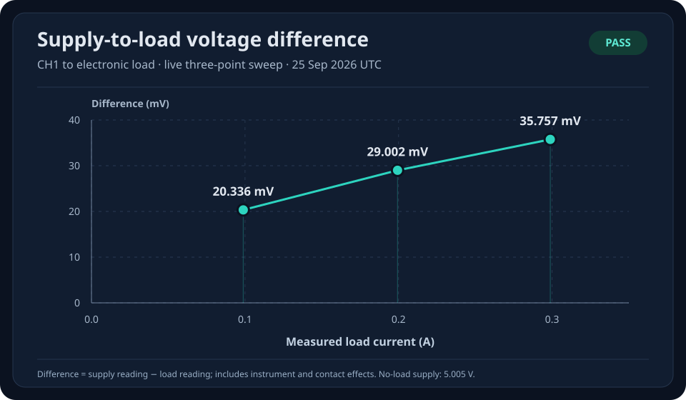

# Rigol Bench Control

Check whether a power supply and its connecting wires deliver enough voltage
for a circuit. A Rigol electronic load stands in for the circuit, letting you
repeat the same test without connecting a real board. Run it from a Raspberry
Pi or Linux computer and inspect the results in an offline HTML report.

**Status:** working bench prototype · **Python:** 3.11+ · **Verified bench:** DP821A + DL3031A

**Hardware:** Rigol DP800-series supplies and DL3000-series electronic loads over
LXI/VXI-11 (LAN); verified on a DP821A and a DL3031A. **Safety stance:** every
setpoint is checked against explicit, hand-maintained limits before a VISA
session opens; limits are never inferred from a model name; software limits
complement, never replace, the instruments' own OVP/OCP/OPP; tests and CI use
fake instruments only. **Start:** [Getting started](dcdc-bench/docs/getting-started.md)
· [Contributing](CONTRIBUTING.md).

**DC–DC converter work:** the separate [dcdc-bench project](dcdc-bench/README.md)
provides saved converter profiles, a local test interface, bounded real DC sweeps,
and interactive HTML/vector PDF reports. See [the bench workflow](dcdc-bench/docs/bench-ui.md)
and its milestone position in [implementation status](dcdc-bench/docs/implementation_status.md)
(M0 reached; M1 substantially reached; M2 partial; an M3 workflow slice
demonstrated; M4 and M5 software present on mock and stored data only). Real
converter runs additionally require saved-profile approvals and a fresh
wiring/serial confirmation at each Start. The bench interface listens only on
the bench computer's loopback interface (`http://localhost:8081/` on the
development Pi through an SSH port forward; that address does not work from
GitHub). Its [completed real workflow test](dcdc-bench/README.md#completed-test-through-the-interface)
includes the automatically generated HTML and PDF.
It also includes a [measured 12T12-4A converter test](dcdc-bench/README.md#longer-real-converter-test):
24 V input, a 50–500 mA sweep, a three-minute hold, and a return sweep.
The newer [test near the supply limit](dcdc-bench/README.md#test-near-the-supply-limit)
reached **1.725 A output** while drawing **0.987 A from the 24 V supply**.
The latest [efficiency comparison](dcdc-bench/README.md#efficiency-at-different-input-voltages)
adds **24 V and near-36 V curves**, reaching **2.5 A output**. Its separate
12 V startup attempt stopped without a qualified efficiency result.
A later [startup experiment](dcdc-bench/docs/startup-descent-results-review.md)
started at 15 V and kept the output at **12.134 V with a 100 mA load** while
reducing measured input to **9.108 V**, without restarting the converter.
Those converter artifacts are local; the published 5 V demo below is the
existing supply-to-load test.

## Interactive demo

### [Open the interactive 5 V power test →](https://robomaniac.github.io/rigol-control/Data/power-test-report.html)

Explore 22 real measurements: hover over the graphs, move through the test,
and download the results. It opens in your browser without installing anything
or connecting to the Pi.

[Measured CSV](Data/power-test-results.csv) · [Simulated example](https://robomaniac.github.io/rigol-control/Data/sweep-preview.html) ·
[Demo YAML](Software/recipes/load_sweep.yaml) · [Wiring](Electrical/Wiring.md)

## Table of contents

- [Interactive demo](#interactive-demo)
- [Start here](#start-here)
- [Demo: will your circuit still receive 5 V?](#demo-will-your-circuit-still-receive-5-v)
  - [What happens during the test](#what-happens-during-the-test)
  - [What the result tells you](#what-the-result-tells-you)
  - [Real bench result](#real-bench-result)
  - [Connect and run — YAML recipe](#connect-and-run)
  - [Actual files from the demo](#actual-files-from-the-demo)
- [Explore the report](#explore-the-report)
- [Commands](#commands)
- [Project folders](#project-folders)
- [Verify and publish](#verify-and-publish)
- [Next experiments](#next-experiments)



This original three-point chart is a measured snapshot from the bench. The
new measured report contains 21 loaded readings plus a starting reference.
See [data provenance](Data/README.md) for which run each artifact contains.
The report links above open interactive pages hosted on GitHub Pages, with no
Pi connection or port forwarding needed. Opening an `.html` file in GitHub's
repository view shows its source code. You can also download the file and open
it in a browser to use the same report offline.

## Start here

You can open the saved reports without installing anything or connecting hardware.
The **real 5 V power test** contains 22 readings from the DP821A and DL3031A.
The separate simulated example illustrates the same display with invented values.
Move over a chart for readings, use the point slider or arrow keys to follow the
run, search the measurement table, or download its full-precision CSV.
The current overview follows the reading numbers, so you can see demand rise
and then fall. The other graphs compare results at the same current; their
outward and return traces sit beside each other.

To run the software, work from the **repository root**:

```bash
python3 -m venv .venv
source .venv/bin/activate
python -m pip install -e '.[dev]'
cp -n Software/config/lab.example.yaml Software/config/lab.yaml
```

The local `lab.yaml` is ignored by Git. Replace its two `.invalid` hostnames
with your instruments' addresses. Read their identities, then put the returned
serials in `expected_serial` to pin subsequent commands to those instruments:

```bash
benchctl identify --setup main_bench
```

Serial pinning is optional in the schema; an unset serial does **not** block
control commands. Set both before using the bench. The example uses operating
limits for this 5 V demo, not the instruments' full ratings.

Validate the complete sweep without contacting hardware:

```bash
benchctl run Software/recipes/load_sweep.yaml --setup main_bench --dry-run
```

For a completely offline first check, add
`--config Software/config/lab.example.yaml` to that command.

## Demo: will your circuit still receive 5 V?

**[Open the interactive results from this test →](https://robomaniac.github.io/rigol-control/Data/power-test-report.html)**

Imagine a small circuit that needs 5 V and draws between 50 and 300 mA.
Before connecting it, we can check the supply and wires using the electronic
load as a stand-in. The load draws the current we ask for, just as the circuit
would. At 5 V, 50 mA is about 0.25 W and 300 mA is about 1.5 W.

**The useful question:** when the circuit asks for more current, does enough
voltage still reach its end of the wires?

### What happens during the test

1. Set the supply to **5 V** and measure it before the load draws current.
2. Ask the load to draw **50 mA**, wait four seconds, and measure voltage at
   both the supply and the load.
3. Repeat in **25 mA steps up to 300 mA**, then work back down to 50 mA.
4. Check the readings and turn the load and supply output off.

That is 21 loaded readings at 11 current levels, plus the starting reference.
The load briefly turns off between levels while its setting changes, with a
half-second pause before enabling it again. This checks settled voltage; it does not capture fast dips during a sudden change.
Allow roughly two minutes, including communication with the instruments.

For this example, we choose **4.75–5.25 V** as the acceptable range for a 5 V
circuit. Use the voltage range required by your own circuit when adapting it.
This is a chosen test limit, not a claim of USB certification.

### What the result tells you

| Result | What it helps you check |
| --- | --- |
| Lowest voltage at the device end | Did enough voltage reach the circuit throughout the test? |
| Voltage at the supply | Did the source itself hold its voltage as demand increased? |
| Difference between the two readings | Are the wires or contacts worth investigating? Instrument offsets also contribute. |
| Readings while reducing demand | Do repeated current levels give similar results? |

For example, a reading named **“250 mA · Reducing demand”** means the load is
asking for 250 mA on the way back down. Its voltage is what a circuit would
receive at that point. The report keeps raw file identifiers in the exported
data so the main view can use these readable descriptions.

**Why two graph shapes?** The current overview uses reading number on its
horizontal axis: reading 1 is the starting reference, reading 12 reaches
300 mA, and reading 22 returns to 50 mA. That makes a rise-and-fall shape.
The voltage and power graphs use current on the horizontal axis, with rounded
mA tick marks. Returning to 250 mA puts a reading back at the same horizontal
position as the earlier 250 mA reading. This makes the two directions easy to
compare. Tick labels are rounded; the saved readings retain their precision.

### Real bench result

The [measured 21-point test](https://robomaniac.github.io/rigol-control/Data/power-test-report.html) passed on
26 September 2026 UTC. Voltage at the device stayed between **4.978736 and
4.989864 V**, within the chosen 4.75–5.25 V range. The largest difference between
the supply and device readings was **26.264 mV**. Peak measured demand was
**299.28 mA**, using **1.490034 W**.

The run took about **105 seconds**. All acceptance checks passed; a separate
readback afterward confirmed both the load input and CH1 output were off.
The [original three-point report](https://robomaniac.github.io/rigol-control/Data/demo-report.html) and chart remain
available, and the [simulated example](https://robomaniac.github.io/rigol-control/Data/sweep-preview.html) stays separate.

### Connect and run

With both outputs off, connect CH1 positive to load positive and CH1 negative
to load negative. Follow the [wiring and protection settings](Electrical/Wiring.md).
The supply allows **up to 500 mA**; this demo requests at most **300 mA**.
The current limit is a ceiling, not a current forced into the load.
The recipe attempts to turn the load off, then CH1 off when execution exits.
Configure the instruments' hardware protection settings separately.

The actual runnable script is
[Software/recipes/load_sweep.yaml](Software/recipes/load_sweep.yaml):

```yaml
# 5 V power delivery test: does enough voltage reach a device as demand rises?
# The electronic load stands in for a device, drawing 50 to 300 mA in 25 mA
# steps, then reducing demand. We measure voltage at both ends of the wires.
# There are 21 loaded readings at 11 current levels, plus an unloaded reference.
# This demo accepts 4.75–5.25 V; choose bounds appropriate for your own circuit.
# Check wiring/protection settings first. The load briefly turns off between
# readings, so this checks settled voltage rather than fast changes in demand.
# Run from the project root; report with: benchctl report --latest load_sweep
schema_version: 1
name: load_sweep

requires:
  supply: {kind: power_supply}
  load: {kind: electronic_load}

parameters:
  supply_channel: 1
  voltage_v: 5.0
  current_limit_a: 0.50
  load_start_a: 0.05
  load_stop_a: 0.30
  load_step_a: 0.025
  load_tolerance_a: 0.02
  supply_tolerance_a: 0.03
  min_acceptable_voltage_v: 4.75
  max_expected_voltage_v: 5.25
  max_load_power_w: 2.0
  configure_settle_s: 0.5
  settle_s: 4.0

steps:
  # Start from a known off state before changing either instrument's settings.
  - action: load.input_off
  - action: supply.output_off
    channel: "${parameters.supply_channel}"
  - action: supply.configure
    channel: "${parameters.supply_channel}"
    voltage_v: "${parameters.voltage_v}"
    current_limit_a: "${parameters.current_limit_a}"
  - action: supply.output_on
    channel: "${parameters.supply_channel}"
  - action: wait
    seconds: "${parameters.settle_s}"

  # Baseline for voltage droop: load input is still off.
  - action: measure
    save_as: no_load
    values:
      supply_voltage_v:
        source: supply.voltage
        channel: "${parameters.supply_channel}"
        expect: {min: "${parameters.min_acceptable_voltage_v}", max: "${parameters.max_expected_voltage_v}"}
      supply_current_a:
        source: supply.current
        channel: "${parameters.supply_channel}"
        expect: {min: 0.0, max: 0.03}
      supply_power_w: {source: supply.power, channel: "${parameters.supply_channel}"}

  # The parser expands and validates every point before contacting hardware.
  # Keep the load off while changing CC setpoints. Each enable also checks
  # measured voltage/current/power before waiting for the final reading.
  - action: sweep
    start: "${parameters.load_start_a}"
    stop: "${parameters.load_stop_a}"
    step: "${parameters.load_step_a}"
    return_to_start: true
    steps:
      - action: load.input_off
      - action: load.configure_cc
        current_a: "${sweep.value}"
        max_voltage_v: "${parameters.max_expected_voltage_v}"
      # Allow the instrument to finish changing mode/current before enabling.
      - action: wait
        seconds: "${parameters.configure_settle_s}"
      - action: load.input_on
      - action: wait
        seconds: "${parameters.settle_s}"
      - action: measure
        save_as: "point_${sweep.index}_${sweep.value}_a"
        values:
          supply_voltage_v:
            source: supply.voltage
            channel: "${parameters.supply_channel}"
            expect: {min: "${parameters.min_acceptable_voltage_v}", max: "${parameters.max_expected_voltage_v}"}
          supply_current_a:
            source: supply.current
            channel: "${parameters.supply_channel}"
            expect: {target: "${sweep.value}", tolerance: "${parameters.supply_tolerance_a}"}
          supply_power_w: {source: supply.power, channel: "${parameters.supply_channel}"}
          load_voltage_v:
            source: load.voltage
            expect: {min: "${parameters.min_acceptable_voltage_v}", max: "${parameters.max_expected_voltage_v}"}
          load_current_a:
            source: load.current
            expect: {target: "${sweep.value}", tolerance: "${parameters.load_tolerance_a}"}
          load_power_w:
            source: load.power
            expect: {min: 0.0, max: "${parameters.max_load_power_w}"}

finally:
  - action: load.input_off
  - action: supply.output_off
    channel: "${parameters.supply_channel}"
```

After checking wiring, hardware limits and your local inventory:

```bash
benchctl run Software/recipes/load_sweep.yaml --setup main_bench
benchctl report --latest load_sweep
```

The first command prints the run directory; the second prints the HTML file to
open. `report` only reads saved files. Every sweep point is expanded and checked
against the configured limits **before** an instrument connection opens.

### Actual files from the demo

The successful run produced the files below. Open the
[complete example run](Data/Example_Run/20260926T072124Z_load_sweep/) to inspect
the actual records from the **50 → 300 → 50 mA** test:

```text
Data/Example_Run/20260926T072124Z_load_sweep/
├── run.json
├── execution.jsonl
├── measurements.jsonl
├── measurements.csv
├── report.html
└── postflight.json
```

| File | What you will find |
| --- | --- |
| [run.json](Data/Example_Run/20260926T072124Z_load_sweep/run.json) | Test settings, start/end times, instrument models, and the final `pass` result. |
| [execution.jsonl](Data/Example_Run/20260926T072124Z_load_sweep/execution.jsonl) | Each action in order: change current, enable the load, wait, measure, and shut down. |
| [measurements.jsonl](Data/Example_Run/20260926T072124Z_load_sweep/measurements.jsonl) | All 22 readings, including the limits checked and each reading's result. |
| [measurements.csv](Data/Example_Run/20260926T072124Z_load_sweep/measurements.csv) | Those readings and checks in a spreadsheet-friendly table. |
| [report.html](https://robomaniac.github.io/rigol-control/Data/Example_Run/20260926T072124Z_load_sweep/report.html) | Open the interactive graphs and results, generated from these files. |
| [postflight.json](Data/Example_Run/20260926T072124Z_load_sweep/postflight.json) | The separate check confirming CH1 and the load input were off afterward. |

`JSONL` means one JSON record per line. This is a shareable copy of the real
run: instrument serial numbers are redacted; measurements and action records
are preserved. `postflight.json` was added by the separate shutdown check; the
normal recipe runner creates the other data files, and `benchctl report`
creates the HTML.

You can regenerate this example's report **without connecting instruments**:

```bash
benchctl report Data/Example_Run/20260926T072124Z_load_sweep
```

## Explore the report

- Hover and tap inspection, crosshairs, keyboard navigation and an acquisition-order slider.
- Clear descriptions of readings while increasing and reducing demand.
- A plain-language result using the saved voltage limits, with the underlying readings available.
- A searchable measurement table and CSV download, with raw readbacks preserved.
- Clear pass/fail/incomplete status, including partial data when a run fails.

The [actual demo files](#actual-files-from-the-demo) above show what a run
contains. Your own raw runs and traffic logs stay local because they can contain
addresses and serials. See [Data](Data/README.md) for provenance, file
formats, timestamps, and instructions for opening the report over SSH.

## Commands

| Command | Use |
| --- | --- |
| `benchctl identify --setup main_bench` | Read instrument identities. |
| `benchctl measure --device psu_rigol_1` | Read supply voltage, current and power. |
| `benchctl run RECIPE --setup main_bench --dry-run` | Validate without hardware. |
| `benchctl run RECIPE --setup main_bench` | Execute the recipe and record results. |
| `benchctl report --latest load_sweep` | Build an offline report from the latest sweep. |
| `benchctl input-off --device load_rigol_1` | Request load shutdown. |
| `benchctl output-off --device psu_rigol_1 --channel 1` | Request CH1 shutdown. |
| `benchctl web` | Open the separate read-only live dashboard on port 8080. |

Rebuild the simulated preview with `python Software/create_preview.py`.

Use `benchctl COMMAND --help` for manual setpoints and path overrides.
The software targets Linux/Pi; native Windows is not supported because the
transport uses POSIX instrument locks. The dashboard is unauthenticated and
binds to localhost by default. Use SSH forwarding for remote access.

## Project folders

Folders are named for their contents:

```text
Documentation/   benchctl architecture, GitHub publishing guide, the DC–DC plan,
                 and bench-operator notes about the development Pi
Electrical/      Bench wiring and protection settings
Media/           README chart
Data/            Reports/CSV and Example_Run/; ignored local Runs/ and Logs/
Software/        benchctl: src/, tests/, config/, recipes/, developer guide
dcdc-bench/      DC–DC characterization subproject: own pyproject, tests, docs/
.github/         CI: fake-instrument tests on Python 3.11 and 3.13
index.html       GitHub Pages entry; redirects to the measured 5 V report
.nojekyll        Lets GitHub Pages serve the saved HTML reports unchanged
pyproject.toml   benchctl install and test entry point from the repository root
```

See the [developer guide](Software/README.md) and
[architecture](Documentation/Architecture.md) for the code map and extension points.

## Verify and publish

```bash
python -m pytest Software/tests -q
python -m pytest dcdc-bench/tests -q -m 'not browser and not pdf and not integration'
```

Tests use fake instruments; the same commands run in
[GitHub Actions](.github/workflows/ci.yml) on Python 3.11 and 3.13. The
browser/PDF gates need Chromium and Quarto and run in a separate, non-blocking
CI job. See the [verification record](Data/Verification.md) and
[CONTRIBUTING.md](CONTRIBUTING.md). [Publishing to GitHub](Documentation/Publishing.md)
explains commit identity, ignored files, authentication and the first push.

## License

**To be chosen by the repository owner.** There is no `LICENSE` file yet, so no
reuse permission is granted beyond viewing on GitHub. Before inviting reuse,
check whether any code was adapted from the GPL-3.0 project referenced in
[the DC–DC plan](Documentation/DC-DC-Characterization-Plan.md), then add the
chosen license text as `LICENSE` and the matching `license` field to both
`pyproject.toml` files.

## Next experiments

Repeat the test with a second set of wires and see which connection delivers
more voltage at the same current. Keep the operating envelope
within the verified hardware limits. Time-series logging and transient tests
would be separate recipes with different measurement requirements.
